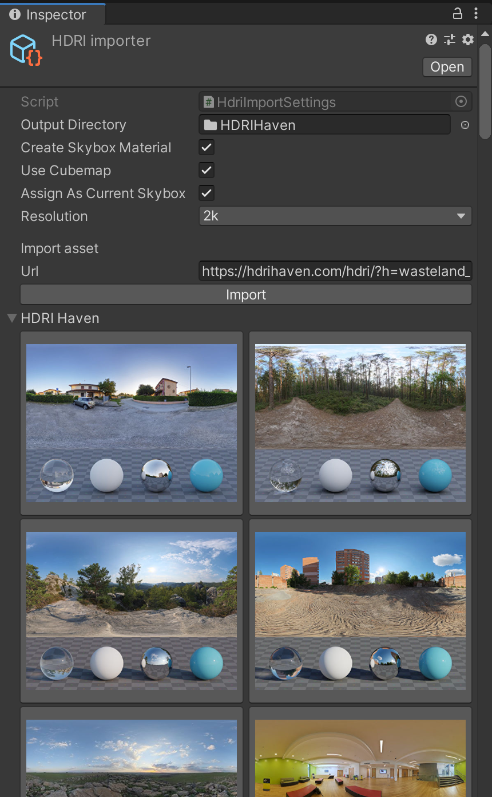

# Steal With Attribution

I made this tool so I could quickly try out skyboxes from HDRIHaven in Unity
with one click.



It shows a browser with previews that can be clicked to download, create skybox
materials and assign it to lighting settings.

## Usage

To access the browser, you need to create an importer. Right-click in project
view -> Create -> Steal With Attribution -> HDRI Importer project 

## Installation

Using openupm:

```
openupm add com.johanhelsing.stealwithattribution
```
